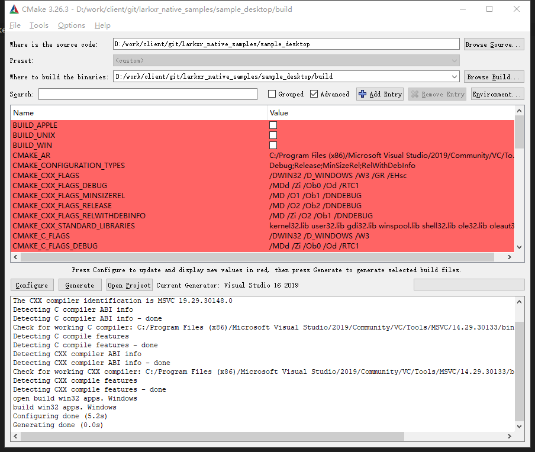

# LarkXR Client SDK Sample

> 目前只支持 windows 系统

示例项目演示 LarkXR Client SDK 基本用法。使用 DX11 渲染云端双目画面。
点击左键开始连接，鼠标中键关闭连接

## 编译

1. 使用 CMake 配置，生成 windows 64 项目




2. 填写必须配置

打开 application.cpp, 填写 sdkid，serverip，serverport，和 appid

```c++
/******************************************************/
// 配置参数
// SDK ID 可以自助申请,也可以联系商务获取。要注意SDKID与服务器授权码不是同一个。
// https://www.pingxingyun.com/console/#/
#define LARK_SDK_ID "Your sdk id"
// 服务器地址
#define SERVER_IP   "ServerIP"
// 服务器端口号
#define SERVER_PORT 8181
// 云端应用APPID
#define APP_ID      "云端应用的ID"
/******************************************************/
```

3. 编译和运行

拷贝 lark\lib\x64\[Debug/Release]\lark_xr.dll 和 lark\thirdparty\ 下的 dll 到编译出的目录

配置正确左键点击开始连接云渲染。连接成功显示双面画面。

